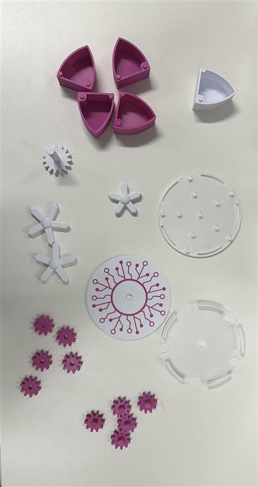
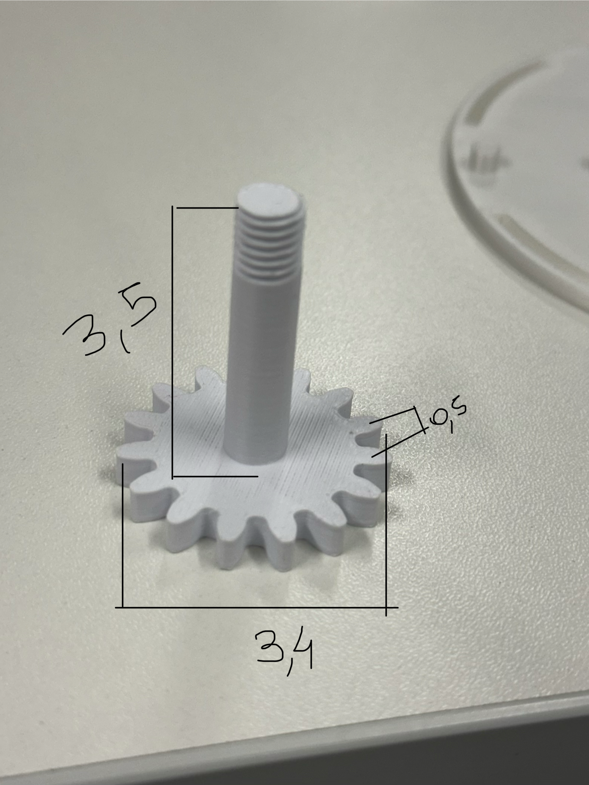
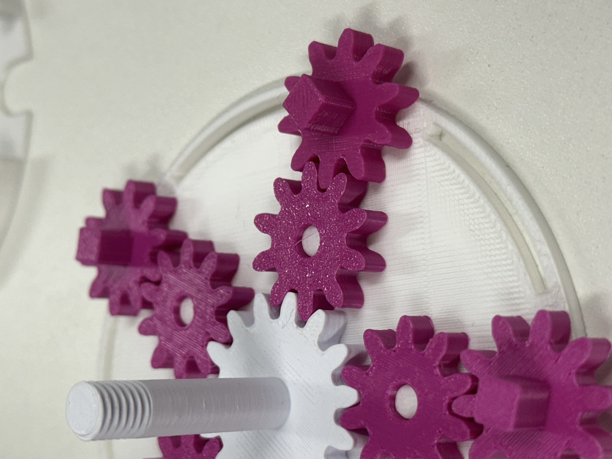
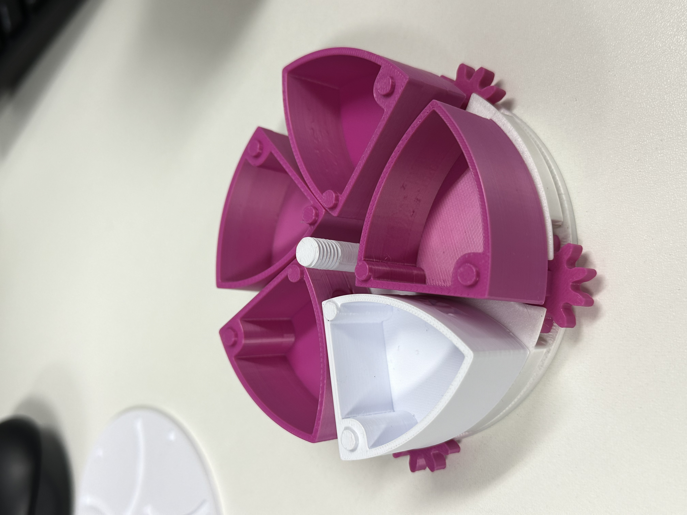
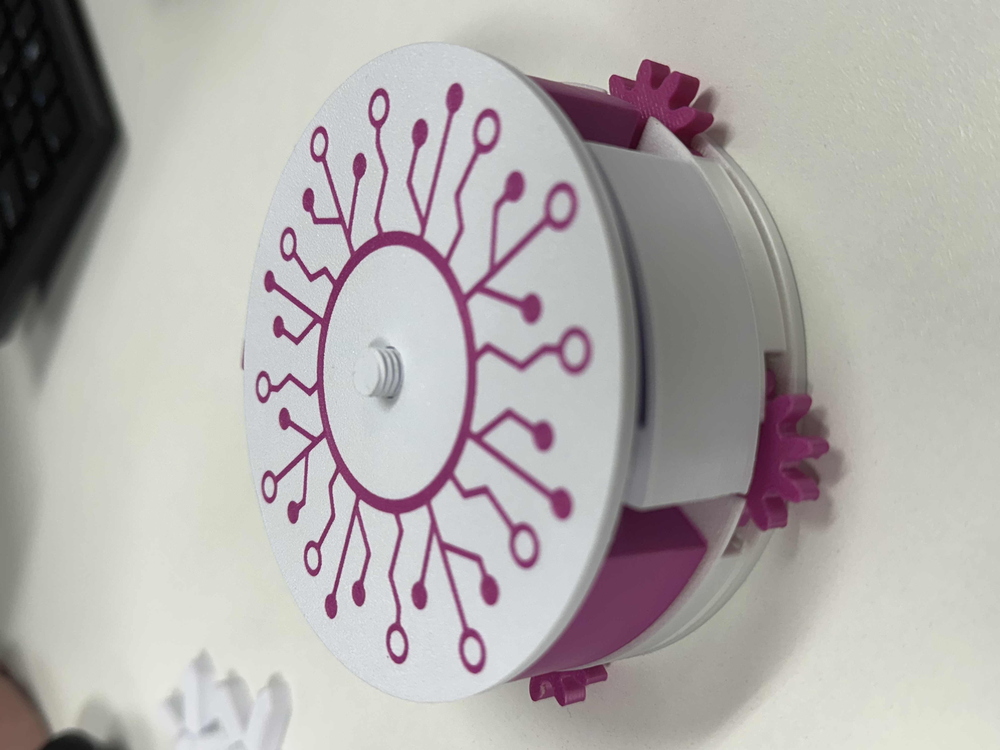
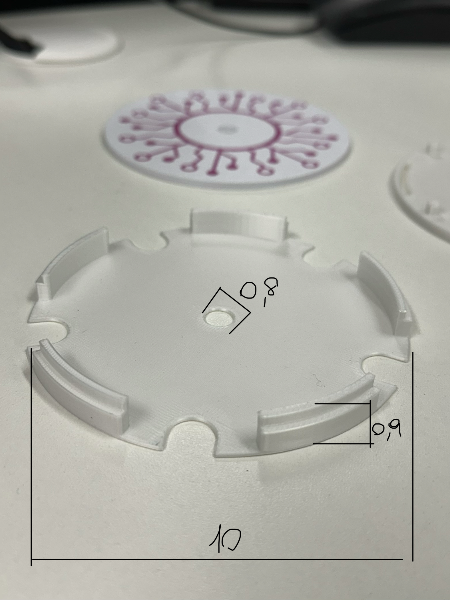
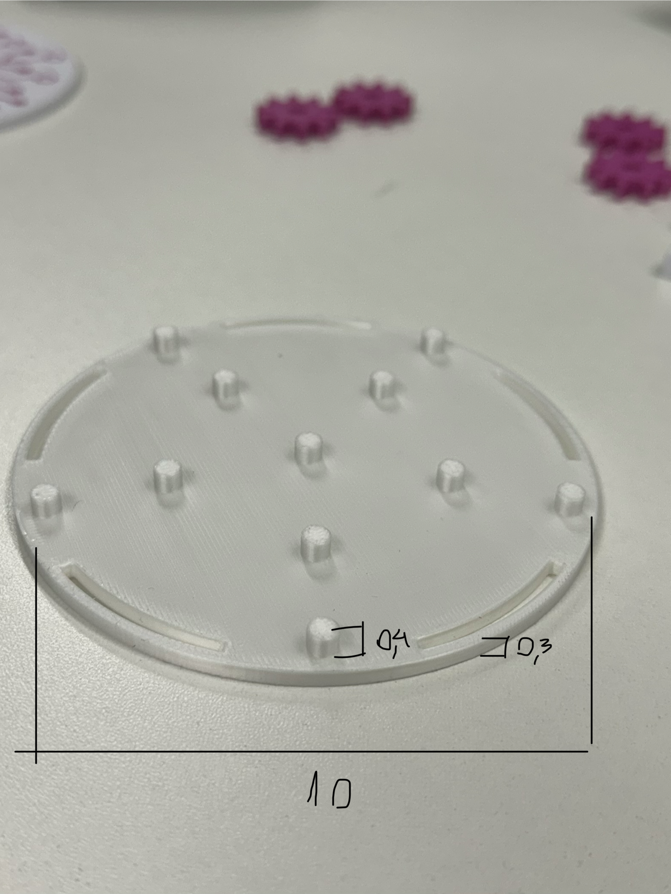
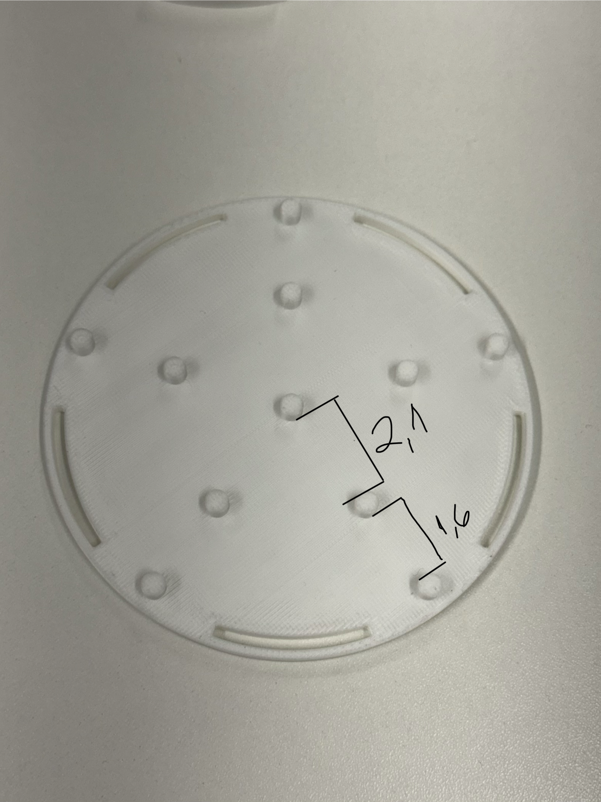
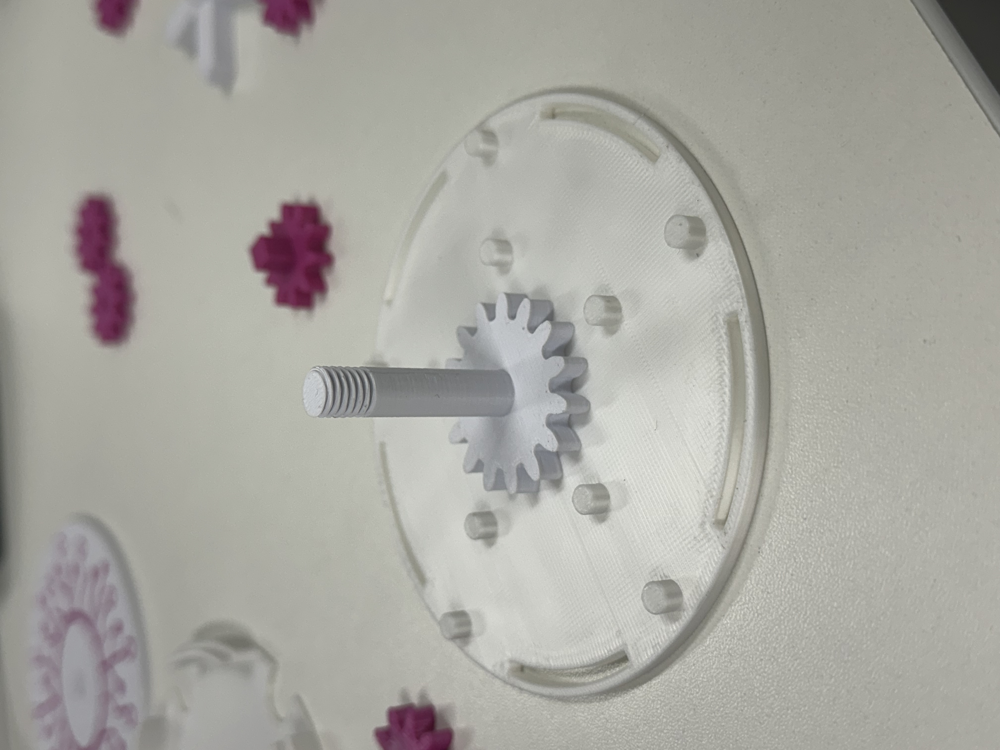

**Project-based Maker Lab**  
**Check Point 02 – Engenharia de Software**

## Integrantes do grupo
- Anny Dias rm98295
- Henrique Lima rm551528
- Pedro Gava rm551043
- Pedro Menezes rm97432

# Caixa Mecânica com Engrenagens

## 1. Objetivo do projeto

Este repositório tem como objetivo documentar a montagem de uma **caixa mecânica com engrenagens**, de forma simples e didática, para que qualquer usuário consiga reproduzir o processo de montagem.  

Além disso, foram realizadas medições das principais peças com paquímetro, observações sobre o funcionamento do mecanismo e a modelagem 3D de uma peça do conjunto.

---

## 2. Componentes recebidos

De acordo com a atividade, o kit é composto por:

- 2 caixas inferiores
- 1 tampa
- 10 engrenagens
- 2 eixos e encaixes
- 5 componentes móveis

---
## 3. Ferramentas utilizadas

- Paquímetro
- Kit da caixa mecânica
- Câmera/celular para registro das fotos
- Software de modelagem 3D (OpenSCAD ou outro)

---

## 4. Medições das peças principais

As medições abaixo foram realizadas com paquímetro para compreender melhor o sistema mecânico.

| Peça | Medida | Valor | Observação |
|------|--------|-------|------------|
| Tampa | Espessura | 3 mm | Medida da espessura total |
| Tampa | Furo de encaixe do eixo | 8 mm | Medida do furo |
| Tampa | Comprimento | 100 mm | Medida do comprimento |
| Base | Comprimento | 100 mm | Medida do comprimento |
| Base | Encaixe  | 4 mm | Medida da expessura do encaixe |
| Base | Espessura | 3 mm | Medida da espessura da base |
| Base | Distancia de encaixe | 21 mm e 16 mm | Medida da distancia do pontos de encaixe |
| Eixo | Altura | 35 mm | Altura total |
| Eixo | Diâmetro | 34 mm | Medida do corpo do eixo |
| Eixo | Espessura | 5 mm | Medida da espessura do eixo |
| Engrenagem | Espessura | 5 mm | Espessura da engrenagem |
| Engrenagem | Comprimento | 23 mm | Comprimento da engrenagem |
| Engrenagem com encaixe| Espessura | 5 mm | Espessura da engrenagem |
| Engrenagem com encaixe | Comprimento | 23 mm | Comprimento da engrenagem |
| Engrenagem com encaixe | Comprimento do encaixe| 6 mm | Comprimento do encaixe da engrenagem |
| Engrenagem com encaixe | Altura do encaixe| 7 mm | Altura do encaixe da engrenagem |
| Estrela | Espessura | 7 mm | Espessura da estrela |
| Estrela | Comprimento | 37 mm | Comprimento da estrela |
| Estrela | Altura | 11 mm | Altura total da estrela |
| Caixa | Espessura | 22 mm | Espessura da caixa |
| Caixa | Altura | 41 mm | Altura da caixa |
| Caixa | Comprimento | 44 mm | Comprimento da caixa |
| Caixa | Espessura do encaixe | 1 mm | Espessura do encaixe da caixa |

### Observações sobre as medições
- As peças apresentam pequenas variações dimensionais.
- Algumas folgas podem influenciar no encaixe e na rotação.
- As medidas foram registradas para auxiliar tanto na montagem quanto na modelagem 3D.

---

## 5. Passo a passo da montagem

A seguir está o processo de montagem documentado com imagens.

### Passo 1 – Separação e identificação das peças
Organizamos todas as peças do kit e identificamos cada componente antes do início da montagem.

---

### Passo 2 – Posicionamento da base da caixa
Selecionamos a caixa inferior e verificamos os pontos de encaixe dos eixos e engrenagens.

---

### Passo 3 – Inserção do eixo
O eixo foi posicionado no furo da base, verificando o alinhamento e a mobilidade.

---

### Passo 4 – Encaixe das engrenagens
As engrenagens foram acopladas ao eixo conforme a disposição necessária para transmissão do movimento.

---

### Passo 5 – Ajuste dos componentes móveis
Os componentes móveis foram posicionados e ajustados para garantir o funcionamento adequado do conjunto.

---

### Passo 6 – Fechamento com a tampa
Após a montagem interna, a tampa foi colocada para fechamento da caixa.

---

### Passo 7 – Teste de funcionamento
Foi realizado um teste para verificar o giro dos eixos, o acoplamento das engrenagens e possíveis travamentos.

.jpg)

.jpg)

.jpg)

.jpg)

---

## 6. Análise do funcionamento do mecanismo

Durante a montagem e os testes, observamos os seguintes pontos:

- O encaixe das peças estava **[frouxo/apertado]**
- O eixo **[girava livremente / apresentava resistência]**
- As engrenagens **[engatavam corretamente / apresentavam desalinhamento]**
- Houve **[ou não houve]** contato com a parede da caixa
- O movimento **[travava / não travava]** em determinados pontos

### Conclusão da análise
O sistema mecânico demonstrou como a correta posição dos eixos e das engrenagens influencia diretamente no movimento e no funcionamento do conjunto. Pequenos desalinhamentos podem causar atrito, perda de eficiência e travamentos.

---

## 7. Peça escolhida para modelagem 3D

A peça escolhida para modelagem 3D foi:

**[Nome da peça escolhida]**

### Motivo da escolha
Escolhemos essa peça porque ela é importante para o funcionamento do sistema e possui dimensões que podem ser medidas com precisão.

### Arquivo da modelagem
- `modelo/[nome-da-peca].scad`
ou
- `modelo/[nome-da-peca].stl`

### Principais dimensões consideradas
- Comprimento: XX mm
- Largura: XX mm
- Altura/Espessura: XX mm
- Diâmetro (se aplicável): XX mm

---

## 8. Envidências em cm

.png)
.png)

.jpg)
.jpg)
.jpg)
.jpg)
.jpg)
.jpg)
.jpg)
.jpg)
.jpg)
.jpg)